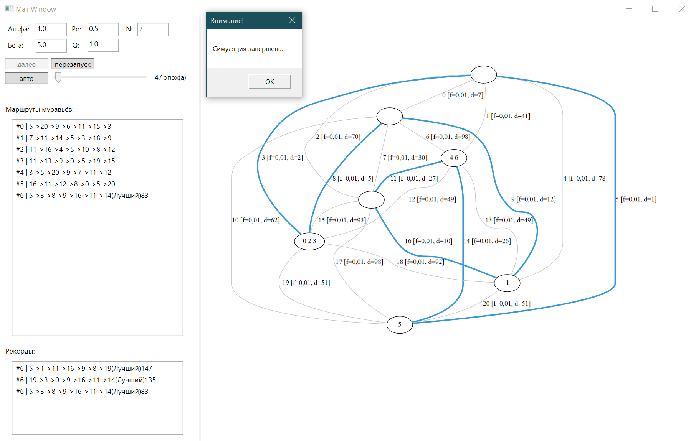

# AntLab - Ant Colony Optimization Simulation 

## Overview
AntLab is a Windows desktop application developed in C# using WPF. It simulates the Ant Colony Optimization (ACO) algorithm to solve optimization problems, particularly the Traveling Salesman Problem (TSP). The application visualizes the behavior of ants as they search for the shortest path in a graph-based environment.

01.11.2020, Belgorod State Technological University, 2nd year, course on the fundamentals of artificial intelligence

## Features
- **Graph Visualization:** Displays the environment where ants traverse nodes and edges.
- **Parameter Configuration:** Allows users to adjust key ACO parameters:
  - **QVAL** - Influence of pheromones.
  - **ALPHA** - Weight of pheromone influence.
  - **BETA** - Weight of heuristic information.
  - **RHO** - Pheromone evaporation rate.
- **Step-by-Step Execution:** Users can run the simulation step-by-step to analyze how ants explore and reinforce paths.
- **Automatic Simulation Mode:** Executes multiple iterations to find an optimal solution automatically.
- **History Tracking:** Displays the path history of ants and highlights the best solution found.

## Installation
1. Clone or download the repository.
2. Open the project in **Visual Studio**.
3. Ensure that the necessary dependencies are installed.
4. Build and run the project.

## Usage
1. **Set Parameters**: Adjust ACO parameters using the text boxes.
2. **Initialize Graph**: Click the **Restart** button to generate a new environment.
3. **Run Simulation**:
   - Click the **Step** button to process one epoch manually.
   - Click the **Auto Run** button to let the algorithm run multiple iterations automatically.
4. **View Results**: The best path found is displayed, and detailed logs of ant movements are shown in the list box.

## Requirements
- Windows OS
- .NET Framework (WPF)
- Visual Studio (for development)

## Author
Developed as part of an optimization research project.

## License
This project is licensed under the MIT License.

